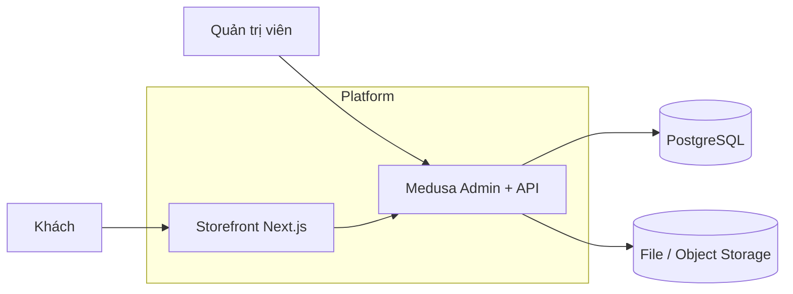

---
stepsCompleted:
  - step-01-init
  - step-02-context
  - step-03-starter
  - step-04-decisions
  - step-05-patterns
  - step-06-structure
  - step-07-validation
  - step-08-complete
  - architecture-supplement-wave2-wave3-2026-04-06
  - architecture-supplement-wave4-news-2026-04-07
inputDocuments:
  - _bmad-output/planning-artifacts/prd.md
  - _bmad-output/planning-artifacts/ux-design-specification.md
workflowType: architecture
project_name: ecomerce-viet-lol
user_name: HieuTV-Team-MedusaV2
date: 2026-03-30
lastArchitectureRevision: "2026-04-07"
workflowNote: >-
  Greenfield ban đầu; repo hiện có backend + storefront. Bổ sung 2026-04-06: Wave 2–3 (FR-22…FR-38).
  Bổ sung 2026-04-07: Wave 4 tin tức (FR-39…FR-46, NFR-10) — ADR-19…ADR-25.
document_output_language: Vietnamese
---

# Tài liệu Quyết định Kiến trúc — ecomerce-viet-lol

**Tác giả:** HieuTV-Team-MedusaV2  
**Ngày:** 2026-03-30 · **Bổ sung kiến trúc:** 2026-04-06 · **Wave 4 tin tức:** 2026-04-07  

Tài liệu này chốt **ranh giới hệ thống**, **mô hình dữ liệu mở rộng**, **API**, **media**, **i18n**, **seed** và **triển khai** để các agent/agent con triển khai nhất quán với PRD & UX.

---

## 1. Bối cảnh & ràng buộc đầu vào

| Nguồn | Vai trò |
|--------|---------|
| `prd.md` | FR/NFR đến **FR-46** (thêm wave 4 tin tức **FR-39…FR-46**, **NFR-10**), catalog seed Phụ lục A, PCI ghi nhận |
| `ux-design-specification.md` | IA `/[locale]/…`, Admin zones, carousel/a11y, ISR messaging (cập nhật UX khi thêm màn CMS wave 3) |

**Ràng buộc kỹ thuật (stakeholder):** Medusa Open Source (backend + Admin), Storefront **Next.js**.  

**Giả định phiên bản:** **Medusa 2.x** (workflow module, API route pattern `@medusajs/framework`). Nếu repo sau này cố định bản patch khác, cập nhật mục 10 trước khi dev.

---

## 2. Tầm nhìn C4 (tóm tắt)

### 2.1 Ngữ cảnh hệ thống



### 2.2 Container & luồng dữ liệu chính

- **medusa-backend:** HTTP Admin API + Store API, workers (nếu bật), job upload ảnh.  
- **storefront:** SSR/ISR, gọi **Store API** + **custom store routes** (banner, settings).  
- **PostgreSQL:** dữ liệu commerce + bảng/entity mở rộng CMS nhẹ.  
- **Storage ảnh:** local dev / S3-compatible prod (qua file module Medusa).

---

## 3. Quyết định kiến trúc (ADR tóm tắt)

| ID | Chủ đề | Quyết định | Lý do | Hệ quả |
|----|--------|------------|--------|--------|
| ADR-01 | Repo | **Hai app** trong monorepo (khuyến nghị): `apps/backend` (Medusa), `apps/storefront` (Next.js); root workspace (pnpm/npm) | Tách deploy, dùng chung type OpenAPI/generated nếu sau này cần | CI/CD hai pipeline |
| ADR-02 | i18n catalog | **Metadata đa ngôn ngữ có cấu trúc** trên `Product` và `ProductCollection` (JSON hoặc object key cố định `vi` / `en`) + **cột handle không đổi theo locale** | Đáp ứng FR-4/FR-6 mà không phụ thuộc plugin lạ; Admin UI custom bind | Cần widget Admin chỉnh JSON/fieldset; validate schema |
| ADR-03 | i18n storefront | **Prefix path** `/:locale/...` (`vi` mặc định redirect từ `/` → `/vi`) | Khớp UX + NFR-5 | Middleware Next rewrite; `generateStaticParams` theo locale |
| ADR-04 | Cấu hình ngôn ngữ toàn site | **Bản ghi singleton** `store_cms_settings` (hoặc `metadata` trên `Store`) chứa `default_locale`, `enabled_locales[]` | FR-3: đổi từ Admin không redeploy SF nếu SF đọc qua API và ISR | Storefront fetch settings mỗi build interval hoặc on-demand revalidate |
| ADR-05 | Banner CMS | **Bảng `store_banner_slide`** (entity Medusa custom) liên kết file_id ảnh gốc + các trường text JSON `{ vi, en }` + `target_url` + `cta_label` JSON + `sort_order` + `is_active` | FR-7…FR-10; reorder | Migration mikro-orm theo chuẩn Medusa 2 |
| ADR-06 | Ảnh banner | Sau upload: job/workflow tạo **derivatives** `w=430`, `w=1280` (tên gợi ý) WebP; lưu URL trong metadata slide hoặc bảng con | NFR-1 | Phụ thuộc sharp pipeline hoặc Medusa image service |
| ADR-07 | Logo | `store_cms_settings.logo_file_id` + URL resolved | FR-11 | Invalidate cache kèm banner |
| ADR-08 | Menu collections | Storefront gọi **GET** collections có `handle` + parent (nếu có); **không hard-code** danh sách production | FR-13 | Parent-child: dùng collection metadata `parent_handle` hoặc cây `collection_id` — chốt ở mục 4 |
| ADR-09 | Cache storefront | **ISR** `revalidate` 60–300s + **on-demand** `revalidateTag('cms')` khi Admin save banner/logo/settings (HTTP từ backend → SF secret route hoặc queue) | SC-3, UX “hiển thị sau X phút” | Cần `REVALIDATE_SECRET`, doc vận hành |
| ADR-10 | Seed | Script `src/scripts/seed.ts` (hoặc workflow) **idempotent** theo `handle` / SKU | FR-15/16 | Upsert, không duplicate unique |
| ADR-11 | Menu header 2 cấp (FR-29) | **Một nguồn** cây menu lưu trong module `store-cms`: cột **JSONB** `nav_tree` trên bảng singleton (mở rộng settings) **hoặc** bảng `store_cms_nav` (1 row `tree` JSON versioned). Storefront **chỉ** đọc qua **GET `/store/custom/nav-menu?locale=`** sau khi server **resolve** nhãn: `type=collection` + `label_override=null` → lấy tên từ catalog + `metadata.i18n`; `type=link` → validate URL (NFR-4). Mobile drawer dùng **cùng** payload. | FR-29, SC-6 (sau FR-29), J7 | Migration + Admin UI sửa cây; test đồng bộ với collections |
| ADR-12 | Trang nội dung CMS (FR-30) | Bảng **`store_cms_page`**: `slug` (unique), `title` JSON `{vi,en}`, `body` JSON hoặc text (HTML/Markdown — chốt một chuẩn và sanitize server-side), `status` enum `draft` \| `published`, `published_at`, `updated_at`. Store: **GET `/store/custom/cms-pages/:slug?locale=`** chỉ trả **published** trừ preview (ADR-14). Route SF: `app/[countryCode]/(main)/p/[slug]` hoặc `/pages/[slug]` — nhất quán với middleware locale. | FR-30, J8 | XSS: sanitize; ISR tag `cms-pages` |
| ADR-13 | Mở rộng `store_cms_settings` (FR-11b, FR-27, FR-31…33, FR-38) | **Singleton** mở rộng (migration additive): `site_title` → ưu tiên **`site_title_i18n` JSON `{vi,en}`** (fallback `site_title` legacy + env); `tagline_i18n` JSON; `seo_defaults` JSON (`meta_title`, `meta_description` per locale); `og_image_file_id` nullable; `footer_contact` JSON (hotline, email, links MXH — nhãn hiển thị i18n nếu cần); `announcement` JSON `{ enabled, text:{vi,en}, link_url?, starts_at?, ends_at? }`; `not_found` JSON `{ title:{vi,en}, body:{vi,en} }`. | FR-11b, FR-27, FR-31…FR-33, FR-38 | PATCH một endpoint; revalidate tag `cms` |
| ADR-14 | Preview & xuất bản (FR-34, khớp FR-18 Growth) | **Cách 1 (MVP):** bản `draft` không expose Store public; nút **“Xem trước”** tạo **token TTL ngắn** (lưu redis hoặc bảng `cms_preview_token`) + URL storefront `?cms_preview=<token>` middleware đọc và gọi backend **authenticated internal** hoặc token HMAC. **Cách 2 (Growth):** thống nhất workflow publish với FR-18. | FR-34, SC-13 | Secret preview; không leak draft vào CDN cache công khai |
| ADR-15 | Thư viện ảnh (FR-35) | Tận dụng **Medusa File Module**: Admin UI mở **picker** danh sách file gần đây / search theo tên; lưu `file_id` trên slide/logo/og. Không bắt buộc bảng riêng nếu API file đủ. | FR-35 | Quota storage; MIME giữ NFR |
| ADR-16 | Lịch sử / hoàn tác (FR-37) | Bảng **`store_cms_revision`**: `entity_type` (`settings`\|`nav`\|`page`\|`banner`), `entity_id` nullable, `payload_snapshot` JSONB, `created_at`, `actor_user_id`. Admin **GET** list + **POST restore** áp snapshot (transaction). Giới hạn **N bản** (ví dụ 20) theo entity — prune job. | FR-37 | Audit nhẹ; không thay git |
| ADR-17 | Trợ giúp Admin (FR-36) | Nội dung help: file **markdown/i18n** trong repo `docs/admin-help/` hoặc JSON static; Admin UI đọc theo `routeKey` màn hình. Không cần DB trừ khi muốn sửa hot. | FR-36 | Đồng bộ release |
| ADR-18 | Lỗi Admin thân thiện (NFR-9) | Layer **map lỗi** trong custom API: `try/catch` → mã `CMS_VALIDATION`, `CMS_UPLOAD`, … → message **tiếng Việt** cố định; log stack **chỉ** server logger. Không trả `err.stack` JSON cho client. | NFR-9, SC-14 | Contract lỗi document cho FE Admin |
| ADR-19 | Editor thân bài tin (FR-44, FR-45) | PRD **bắt buộc chọn một** trong hai: block *hoặc* một vùng WYSIWYG. **Chốt triển khai wave 4:** **một vùng WYSIWYG** dùng **TipTap** (ProseMirror) trong Medusa Admin UI — hỗ trợ **heading, paragraph, list, bold/italic, link, blockquote**, **image inline** (upload / picker **FR-35**), **paste** từ Word và browser với `transformPastedHTML` / rules TipTap. Lưu DB: **HTML đã sanitize** (khuyến nghị) theo từng locale, hoặc lưu **JSON document** TipTap + render server — team chọn một **chuỗi lưu duy nhất**; MVP khuyến nghị **HTML sanitize** để storefront render đơn giản (`dangerouslySetInnerHTML` sau sanitize phía server hoặc chỉ trả HTML đã làm sạch từ API). **Phương án block editor** (JSON block tree) **không** triển khai song song; chỉ xem xét nếu đổi ADR sau này (mobile SDK, export). | FR-44, FR-45, SC-15 | Gói `@tiptap/*` + pipeline paste ảnh (ADR-24) |
| ADR-20 | Entity bài tin `store_cms_news_article` (FR-40…FR-43, FR-46) | Bảng mới trong module **store-cms**: `id` (uuid), `slug` **global unique** (chuẩn hoá ASCII, sinh từ tiêu đề locale mặc định hoặc nhập tay), `status` `draft`\|`published`, `published_at`, `title_i18n` JSONB (key theo `enabled_locales`: tối thiểu `vi`,`en`, mở rộng `ja` nếu bật), `excerpt_i18n` JSONB optional, `body_html_i18n` JSONB (HTML **đã sanitize** per locale; locale nào chưa có body thì fallback theo policy PRD), `featured_image_file_id` nullable (OG mặc định), `seo_i18n` JSONB (`meta_title`, `meta_description`, optional `og_image_file_id` override per locale), `created_at`/`updated_at`. Index: `(status, published_at DESC)` cho list; unique `slug`. | FR-40…FR-43, FR-46 | Migration + service; đồng bộ với revision (ADR-21) |
| ADR-21 | Revision & preview cho tin | Mở rộng **`store_cms_revision.entity_type`**: thêm giá trị `news_article`. Preview tái sử dụng **ADR-14** (token TTL + query `cms_preview`) — endpoint Store đọc bài **draft** khi token hợp lệ; **không** cache ISR công khai cho URL preview. | FR-34, FR-37 | Cùng pattern với `cms-pages` |
| ADR-22 | Menu “Tin tức” (FR-39) | **Không** hard-code trong storefront production: thêm mục trong **`nav_tree`** (ADR-11) kiểu `link` **nội bộ** `url: "/news"` (relative), `label` i18n `{vi,en,…}` (“Tin tức” / “News”). Seed hoặc hướng dẫn Admin thêm một lần. | FR-39, FR-29 | Cùng resolve pipeline `nav-menu` |
| ADR-23 | Sanitize HTML tin & paste (NFR-10) | Trên **POST/PATCH** Admin: chạy **sanitize** (allowlist tag: `p,br,strong,em,u,h1-h4,ul,ol,li,a[href],blockquote,img[src|alt|title],figure,figcaption`; loại bỏ `script`, `on*`, `javascript:`; giới hạn `style` nếu cho phép rất hẹp). **Hai lớp** tùy chọn: lúc lưu + lúc đọc Store. Ảnh trong HTML: chỉ cho `src` đã trỏ **URL đã upload** (domain allowlist hoặc path `/static`); từ chối `data:` blob từ paste nếu không qua upload (ADR-24). | NFR-10 | Thư viện kiểu `sanitize-html` hoặc `isomorphic-dompurify` (Node) |
| ADR-24 | Paste ảnh từ clipboard | TipTap **Image** extension: sự kiện paste — nếu có file ảnh, gọi **Medusa File upload** → chèn `` vào doc; nếu lỗi → toast tiếng Việt (ADR-18), không im lặng. | FR-44, SC-15 | Giới hạn MIME/size như mục 6 |
| ADR-25 | API & storefront routes tin | **Admin:** `GET/POST/PATCH/DELETE /admin/custom/cms-news`, `POST .../cms-news/:id/publish`, có thể `POST .../cms-news/:id/unpublish`. **Store:** `GET /store/custom/cms-news?locale=&limit=&cursor=` (chỉ `published`, sort `published_at desc`), `GET /store/custom/cms-news/:slug?locale=` — resolve `title/excerpt/body/seo` theo locale + fallback. **ISR / revalidate:** tag **`cms-news`** (và có thể `cms-news-${slug}`) khi publish/save. **SF:** `app/[countryCode]/(main)/news/page.tsx` (list), `news/[slug]/page.tsx` (detail); `generateMetadata` dùng `seo_i18n` + default ADR-13. | FR-39…FR-42, FR-46 | AUTHENTICATE=false Store routes; rate-limit ở edge nếu cần |

---

## 4. Mô hình dữ liệu mở rộng (khái niệm)

### Phạm vi ngôn ngữ (chốt)

**Mặc định tài liệu này (MVP):** **`vi`** và **`en`**. Growth (**FR-17**): locale thứ ba (ví dụ **`ja`**) bật qua `enabled_locales`. **Bài tin (wave 4):** `title_i18n`, `body_html_i18n`, `seo_i18n` dùng **key động** theo `enabled_locales` — không hard-code chỉ hai key nếu Admin đã bật thêm locale. Banner / trang CMS cũ có thể mở rộng tương tự khi đồng bộ sprint.

### 4.1 Metadata i18n (Product / Collection)

Schema gợi ý (JSON trong `metadata.i18n`):

```json
{
  "vi": { "title": "...", "subtitle": "...", "description": "..." },
  "en": { "title": "...", "subtitle": "...", "description": "..." }
}
```

- **Title mặc định** Medusa (`title`) giữ bản **vi** (định danh nội bộ) hoặc copy từ `i18n.vi.title` khi save — team chọn một luật và giữ nhất quán.  
- Storefront: `resolveI18n(entity, locale)` — fallback **`vi`** nếu thiếu key `en` (FR-5).

### 4.2 Phân cấp “Quà theo nhu cầu” / ngân sách

**Quyết định:** ba collection con với **handle cố định** (ví dụ `qua-theo-nhu-cau-duoi-500k`, `qua-theo-nhu-cau-500-1000k`, `qua-theo-nhu-cau-tren-1000k`) và metadata `parent_collection_handle: "qua-theo-nhu-cau"`.  
Storefront: query collections lọc theo metadata **hoặc** dùng collection parent nếu Medusa hỗ trợ grouping native — ưu tiên **metadata + filter API custom** nếu API mặc định chưa đủ.

### 4.3 `store_banner_slide` (các cột logic)

| Trường | Kiểu | Mô tả |
|--------|------|--------|
| id | uuid | PK |
| image_file_id | fk | Ảnh gốc |
| image_urls | json | `{ "mobile": "...", "desktop": "..." }` sau xử lý |
| title | json | `{ "vi":"", "en":"" }` |
| subtitle | json | idem |
| cta_label | json | idem |
| target_url | string | validate scheme http/https |
| sort_order | int | kéo thả |
| is_active | bool | |

### 4.4 `store_cms_settings` (singleton)

- `default_locale`: `vi`  
- `enabled_locales`: `["vi","en"]`  
- `logo_file_id`  
- `updated_at` (cho cache bust)  
- **Mở rộng (ADR-13):** `site_title_i18n`, `tagline_i18n`, `seo_defaults`, `og_image_file_id`, `footer_contact`, `announcement`, `not_found` — kiểu **JSONB** hoặc cột tách tùy độ lớn; ưu tiên **một migration additive** để không phá môi trường đã seed.

### 4.5 Cây menu (`nav_tree`) — ADR-11

**Schema JSON gợi ý** (lưu 1 document, validate bằng Zod/io-ts phía backend):

```json
{
  "version": 1,
  "items": [
    {
      "id": "uuid",
      "label": { "vi": "Danh mục", "en": "Shop" },
      "children": [
        {
          "type": "collection",
          "handle": "my-pham",
          "label_override": null
        },
        {
          "type": "link",
          "url": "https://example.com/promo",
          "label": { "vi": "Khuyến mãi", "en": "Promo" }
        }
      ]
    }
  ]
}
```

- **Resolve:** service `buildNavForLocale(locale)` merge catalog titles khi `label_override == null`.  
- **Đồng bộ:** khi collection đổi tên i18n, menu reflect sau revalidate (không duplicate truth nếu override null).

### 4.6 `store_cms_page` — ADR-12

| Trường | Kiểu | Mô tả |
|--------|------|--------|
| id | uuid | PK |
| slug | string | unique, `^[a-z0-9-]+$` |
| title | jsonb | `{ "vi","en" }` |
| body | text hoặc jsonb | Nội dung; sanitize XSS khi HTML |
| status | enum | `draft` / `published` |
| published_at | timestamptz | nullable |
| updated_at | timestamptz | |

Slug cố định gợi ý seed: `gioi-thieu`, `dieu-khoan`, `bao-mat`, `lien-he` (tùy PRD vận hành).

### 4.7 `store_cms_revision` — ADR-16

- Lưu snapshot theo lần **save** quan trọng (settings, nav, page, tùy chọn banner).  
- **Restore:** transaction ghi đè entity + ghi thêm revision mới (audit chain).
- **Wave 4:** thêm `entity_type = news_article` + snapshot payload bài tin (ADR-21).

### 4.8 `store_cms_news_article` — ADR-20

| Trường | Kiểu | Mô tả |
|--------|------|--------|
| id | uuid | PK |
| slug | string | unique, `^[a-z0-9-]+$` (hoặc quy tắc mở rộng có document) |
| status | enum | `draft` / `published` |
| published_at | timestamptz | nullable |
| title_i18n | jsonb | Mỗi key = locale bật (`vi`, `en`, `ja`, …) |
| excerpt_i18n | jsonb | optional |
| body_html_i18n | jsonb | HTML đã sanitize (ADR-23); key theo locale |
| featured_image_file_id | uuid | nullable; OG mặc định nếu không override SEO |
| seo_i18n | jsonb | `meta_title`, `meta_description`, optional `og_image_file_id` per locale |
| created_at / updated_at | timestamptz | |

**i18n:** schema key động theo `enabled_locales` trong `store_cms_settings` (ADR-04, FR-17); validate khi publish: locale nào hiển thị công khai cần `title` + `body` (hoặc policy fallback ghi trong story).

---

## 5. API & quyền truy cập

### 5.1 Admin (bảo vệ session Medusa)

- `GET/POST/PATCH/DELETE /admin/custom/banner-slides` — CRUD + reorder batch `PATCH { orderedIds: [] }`.  
- `GET/PATCH /admin/custom/cms-settings` — logo, locale, **+ các trường mở rộng ADR-13** (partial PATCH được khuyến nghị).  
- **`GET/PATCH /admin/custom/cms-nav`** — body `{ nav_tree }` validate schema; optional **GET /admin/custom/cms-nav/revisions**.  
- **`GET/POST/PATCH/DELETE /admin/custom/cms-pages`** + **`GET/PATCH .../cms-pages/:id/publish`** — CRUD trang; publish chuyển `status`.  
- **`GET/POST/PATCH/DELETE /admin/custom/cms-news`** + **`POST .../cms-news/:id/publish`** (và tuỳ chọn unpublish) — CRUD bài tin; body gửi lên được **sanitize** (ADR-23) trước khi persist.  
- **`POST /admin/custom/cms-preview-token`** — sinh token xem trước (ADR-14).  
- **`GET /admin/custom/cms-revisions`** + **`POST .../restore`** — liệt kê / khôi phục (ADR-16).  
- Middleware: chỉ role admin có quyền `settings` hoặc custom role; có thể tách vai **content_editor** chỉ CMS không đụng order/payment (theo FR-19 Growth).

### 5.2 Store (public, rate-limit CDN/proxy)

- `GET /store/custom/cms-settings` — logo URL resolved, `enabled_locales`, `default_locale`, **+ các field public** của ADR-13 (tagline, announcement, footer_contact, not_found, seo_defaults — **không** leak draft).  
- `GET /store/custom/banner-slides?locale=vi` — slides active, text đã resolve theo locale (server làm để SF gọn).  
- **`GET /store/custom/nav-menu?locale=`** — cây menu đã resolve nhãn (ADR-11).  
- **`GET /store/custom/cms-pages/:slug?locale=`** — chỉ `published`; header `X-CMS-Preview` hoặc query token khi preview (ADR-14).  
- **`GET /store/custom/cms-news?locale=&limit=&cursor=`** — danh sách bài **published** (ADR-25).  
- **`GET /store/custom/cms-news/:slug?locale=`** — chi tiết một bài; hỗ trợ preview với token (ADR-14, ADR-21).

**URL validation (NFR-4):** chặn `javascript:`, `data:`, cho phép `http`, `https`, `relative` (`/collections/...`) nếu team bật — mặc định **chỉ http(s)**.

---

## 6. Media pipeline

1. Upload qua Medusa **File API** → lưu storage.  
2. Trigger **subscriber/workflow** `banner.image_uploaded`:  
   - Resize/crop center theo tỉ lệ UX (16:9 gợi ý).  
   - Xuất WebP hai kích thước; upload derivative hoặc lưu path.  
3. Admin UI hiển thị progress + preview (theo UX spec).

**Giới hạn:** file gốc ≤ **10MB** (NFR-3 PRD); MIME: `image/jpeg`, `image/png`, `image/webp` (+ `svg` chỉ cho logo nếu chấp nhận rủi ro XSS — khuyến nghị **PNG logo** MVP).

---

## 7. Storefront Next.js

- **App Router**, cấu trúc: `app/[countryCode]/(main)/...` — **semantic locale** `vi`|`en` (giữ convention repo hiện tại).  
- **`next-intl`** (hoặc tương đương) để UI string; nội dung catalog từ API đã resolve locale.  
- **Hình hero:** `next/image`, `sizes` theo breakpoint UX, ưu tiên URL **desktop/mobile** từ API.  
- **Fetch:** server components gọi backend bằng `MEDUSA_PUBLISHABLE_KEY` + custom routes; **tags** `['cms','collections','cms-nav','cms-pages','cms-news']` cho revalidate.  
- **Wave 2 (PRD):** header **chỉ logo trái**; `site_title` + tagline từ **cms-settings** hiển thị **footer**; nav desktop/mobile đọc **`nav-menu`**.  
- **Wave 3:** component **AnnouncementBar** đọc `announcement` từ settings; route **trang CMS** `.../p/[slug]` (hoặc tương đương); **metadata** `generateMetadata` dùng `seo_defaults` + override theo trang nếu có; **404** custom copy từ `not_found` settings khi có.  
- **Wave 4:** **`/news`** danh sách + **`/news/[slug]`** chi tiết (dưới prefix locale); HTML body từ API **đã sanitize** — vẫn **không** render HTML thô từ nguồn không tin cậy; component typography đọc bài (SC-16).

---

## 8. Admin UI mở rộng

- Đăng ký **route zones** (Medusa Admin extension): menu **“Storefront & Nội dung”**.  
- Các màn hiện có: `LocaleSettings`, `BannerList` (dnd-kit reorder), `BannerEditor` (tabs vi/en), `LogoSettings`.  
- **Bổ sung wave 2–3:** `NavEditor` (cây 2 cấp, kéo thả optional), `CmsPageList` / `CmsPageEditor`, `SeoSettings`, `FooterContactSettings`, `AnnouncementSettings`, `NotFoundSettings`, panel **Trợ giúp** (ADR-17), `RevisionHistory` (cho settings/nav/page).  
- **Wave 4:** `NewsArticleList`, `NewsArticleEditor` — **TipTap** (ADR-19) + picker ảnh (ADR-15, ADR-24); tab/locale theo `enabled_locales`; preview gọi token ADR-14; help key theo FR-36.  
- **File picker:** tái sử dụng upload Medusa + danh sách file gần đây (ADR-15).  
- Gọi Admin custom API ở trên; sau save thành công gọi hook **revalidate storefront** (tag tương ứng).  
- **Toast/lỗi:** hiển thị `message` từ API (tiếng Việt) — khớp ADR-18.

---

## 9. Seed & migration

- **Một entrypoint:** `pnpm --filter backend seed` chạy: regions, sales channel (nếu cần), **collections/products/variants/types** theo Phụ lục A PRD.  
- **Idempotency:**  
  - Ưu tiên `handle` collection/product **cố định** trong script.  
  - Logic: `findByHandle` → update nếu tồn tại, else create.  
- **“Quà Tết” placeholder:** tạo `ProductType` + không tạo product hoặc tạo product `status=draft` — đồng bộ quyết định PM; mặc định **không** đưa vào menu (filter `status=published`).

### Handle gợi ý (rút gọn — bổ sung đầy đủ khi dev)

- Collections: `saffron`, `my-pham`, `qua-doanh-nghiep`, `qua-theo-nhu-cau`, `nong-san-viet`, + 3 collection ngân sách.  
- Product Trung Thu: `gia-cong-banh-trung-thu`; variants SKU ví dụ `TET-2`, `TET-4`, `TET-6` (điều chỉnh theo quy ước SKU thực tế).

---

## 10. Bảo mật & vận hành

- Biến môi trường: `DATABASE_URL`, `STORE_CORS`, `ADMIN_CORS`, `JWT_SECRET`, `COOKIE_SECRET`, `REVALIDATE_SECRET`, keys storage.  
- Không log URL banner đầy đủ có token.  
- Backup DB trước migration production.

---

## 11. Kiểm tra căn chỉnh (architecture vs PRD/UX)

| Yêu cầu | Đáp ứng |
|---------|---------|
| FR-1…6 i18n | ADR-02, 03, 04 + metadata schema |
| FR-7…10 banner | ADR-05, 06 + API 5.2 |
| FR-11 logo | ADR-07 |
| FR-11b, FR-27 | ADR-13 `site_title_i18n`, `tagline_i18n` |
| FR-12…14 SF | Mục 7 + ISR ADR-09 |
| FR-15…16 seed | Mục 9 |
| FR-22…FR-29 wave 2 | Mục 4.5, 7, 8, API nav; ADR-11 |
| FR-30…FR-38 wave 3 | ADR-12…18; mục 4.6–4.7, API pages/revisions |
| FR-39…FR-46 wave 4 tin | ADR-19…25; mục 4.8; API `cms-news`; SF `/news` |
| SC-15…SC-16, NFR-10 | ADR-19, ADR-23, ADR-24 + UAT paste |
| SC-13…SC-14, NFR-9 | ADR-18 + checklist UAT (không thuộc AD) |
| NFR ảnh/LCP | ADR-06, `next/image`, ISR |
| UX carousel/a11y | Triển khai trong SF; API cung cấp `alt` từ title locale |

---

## 12. Việc làm trước khi code

1. Khởi tạo monorepo + `medusa new` / starter 2.x. *(đã có trong repo — bỏ qua nếu đã chạy)*  
2. Tạo migration `store_banner_slide`, `store_cms_settings`.  
3. Scaffold Admin extension + Store routes.  
4. Thêm seed handles bảng PRD.  
5. Nối `revalidate` staging với secret.  
6. **Wave 2–3:** migration mở rộng settings (ADR-13), `store_cms_page`, `nav_tree` (hoặc bảng nav), `store_cms_revision`; implement API mục 5; cập nhật SF layout + route `p/[slug]` + announcement + 404.  
7. **Wave 4:** migration `store_cms_news_article`; mở rộng revision + preview cho `news_article`; Admin TipTap + sanitize pipeline; Store `cms-news` + SF `news` + revalidate tag `cms-news`; seed/hướng dẫn mục nav **Tin tức** (ADR-22).

---

## 13. Rủi ro & giảm thiểu

| Rủi ro | Giảm thiểu |
|--------|------------|
| JSON `nav_tree` / settings quá lớn | Validate max depth 2 cấp PRD; giới hạn số node; optional DB normalize sau |
| Draft lộ qua CDN | Preview dùng token + `cache: no-store` hoặc route riêng không ISR public |
| HTML trang CMS — XSS | Sanitize whitelist tags; hoặc chỉ Markdown → HTML server |
| HTML tin tức + paste Word — XSS / style rác | ADR-23 hai lớp; chỉ `src` ảnh đã upload; test paste từ Word thật |
| Revision storage | Prune theo N; không lưu toàn bộ binary |

---

## Bước BMad tiếp theo

- **`bmad-create-ux-design`** — bổ sung wireframe Admin (Nav, Pages, SEO, Announcement, **News editor**) + SF (**/news**, trang tĩnh, 404).  
- **`bmad-create-epics-and-stories`** — epic **Wave 4 tin tức** (story: migration, API, Admin TipTap, SF list/detail, nav seed, UAT paste).  
- **`bmad-check-implementation-readiness`** — sau khi epics khớp PRD + kiến trúc này.  
- Cập nhật **`project-context.md`** khi chốt route **`/news`**, tag **`cms-news`**, và module **sanitize** tin.
